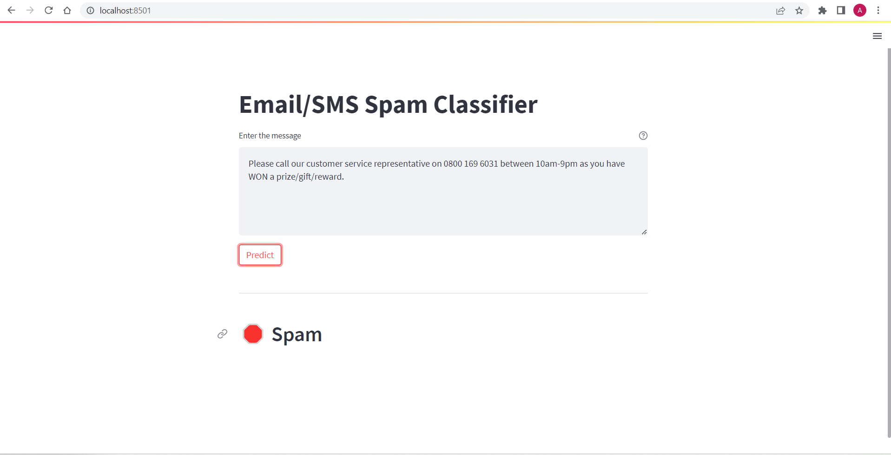
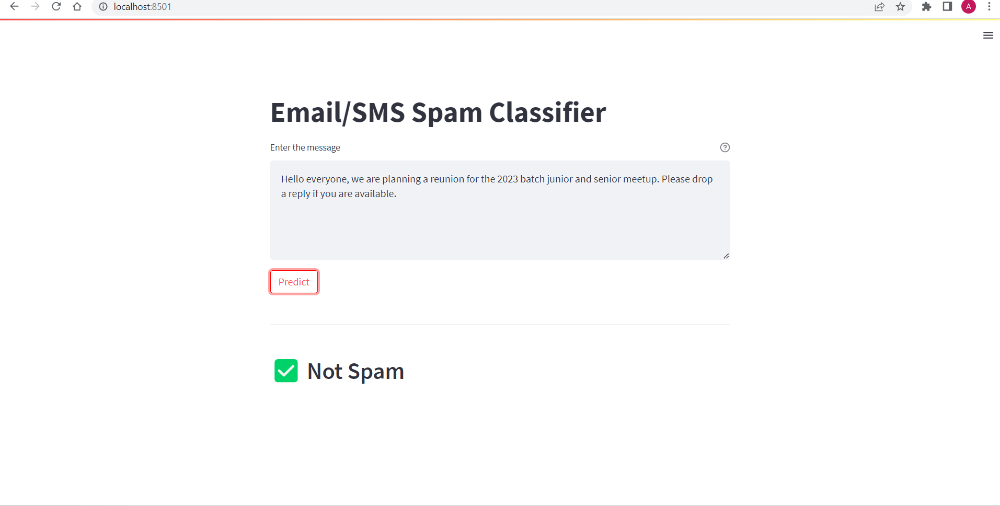
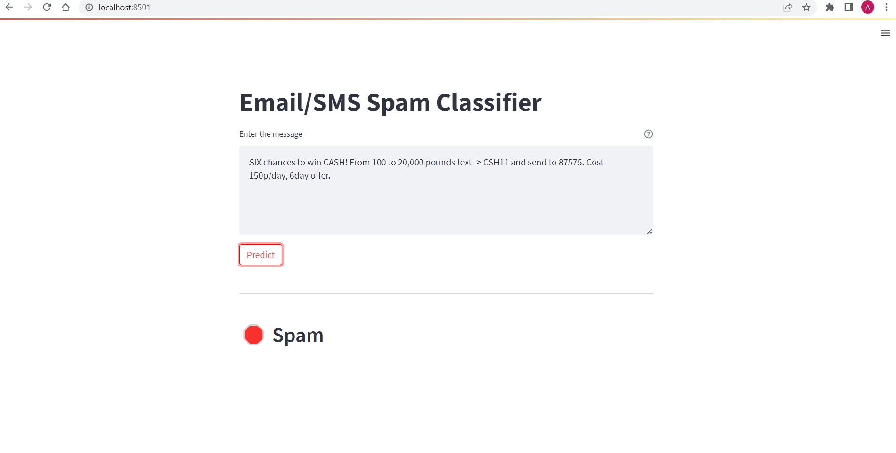

# NO SPAM

NO SPAM is a Spam-Sms-Classifier tool designed to accurately classify text messages as either spam or not spam. Using advanced machine learning algorithms, the classifier analyzes the content of SMS messages and determines their likelihood of being unsolicited or unwanted. By providing a reliable and efficient solution for identifying spam messages, this project aims to enhance communication security and user experience in the realm of text-based communication.


## Project Screenshots







## Installation!

To use the application, follow the below steps for installation:

0. Clone the project by running following command:
```
git clone https://github.com/Altafalam3/NO-SPAM.git
```

1. Install Python and pip on your computer.

2. Make a virtual environment. Run this commands:
```
pip install virtualenv
virtualenv env-sms
env-sms\scripts\activate
```

3. Install all the packages required after activating virtual environment by running this command:
```
pip install -r requirements.txt
```

4. To run the website .
```
streamlit run app.py
```

#### Author

<blockquote>
Feel free to reach out to me if you have any doubts regarding project or any feedbacks.<br/>
Altaf alam<br/>
Email: altaf.alam0032@gmail.com
</blockquote>

========Thank You !!!=========
